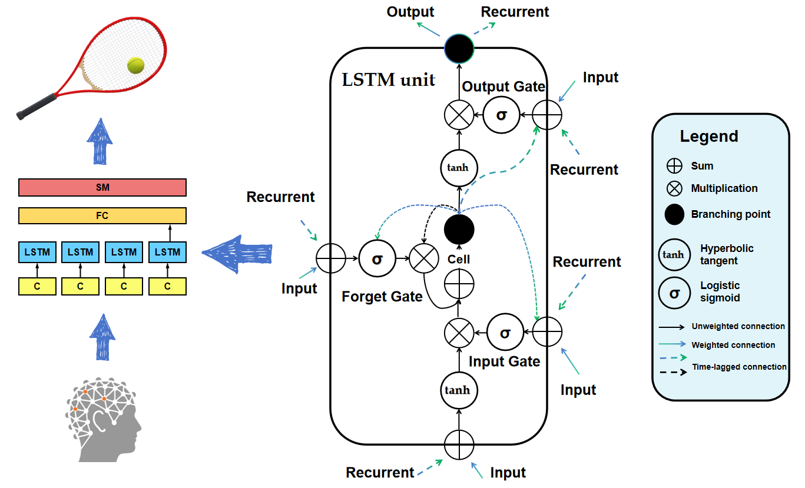
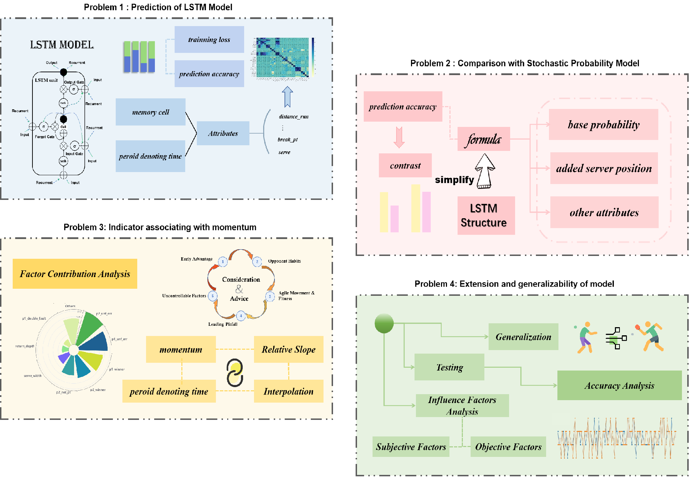
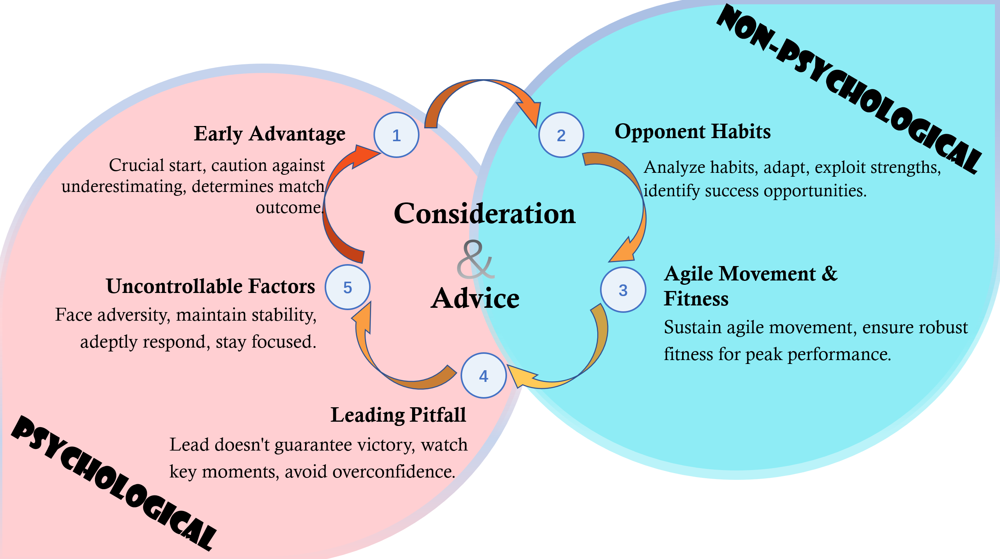

## MM-LSTM: A Momentum LSTM Model for Tennis Match Prediction and Analysis

MM-LSTM is an innovative model designed to predict and analyze tennis matches by capturing the concept of "momentum," which is often observed during matches but cannot be directly measured. The model uses Long Short Term Memory (LSTM) architecture to simulate players' match states, including their current match situation, forgetting past situations, and actions like hitting the ball.

### Key Highlights

- **Correlation Analysis**: Analyzes Spearman correlation coefficients among various match parameters and reduces data dimensionality based on these correlations.
- **Model Performance**: Achieves a loss value of 0.047 and an accuracy of 94.52% on the test set.
- **Comparison with Stochastic Model**: Outperforms a stochastic probability model by 26 percentage points, highlighting the importance of momentum with an accuracy of 94.23%.
- **Gradient Analysis**: Investigates the relationship between score changes and predicted probabilities, using gradient importance analysis to determine the impact of various factors on momentum.
- **Generalization**: Expands the model to include subjective and objective factors, and evaluates its performance on 2024 WTT table tennis match data, noting the need for more data to improve performance.

The research concludes with a memorandum summarizing findings, demonstrating the role of momentum in matches, and providing detailed advice for coaches and players on handling momentum.
